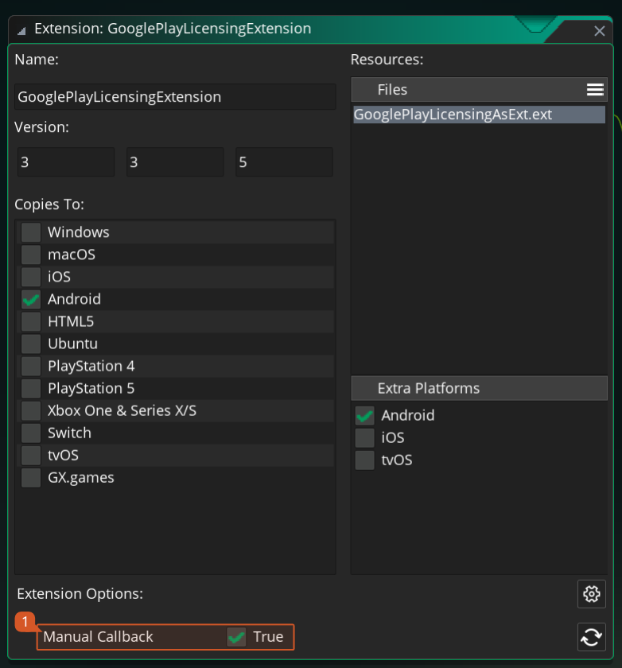

@title Extension Options

You can get access to the [Extension Options](https://manual.yoyogames.com/The_Asset_Editors/Extensions.htm#extension_options) panel by navigating to the extension asset in the [Asset Browser](https://manual.yoyogames.com/Introduction/The_Asset_Browser.htm) and double clicking it.

In the extension options for this version of the extension you will find an **SDK Folder Name** option that should be poiting to the folder in your local machine where the Google Play Lincense SDK exists.

> [!NOTE]
> This folder cannot exist within your project and should live outside of the project structure.

It's also possible to configure the default strings to be used for the various states the licensing check can end up in. The list includes:

* Retry Buttom (the text to display inside the button)
* Buy Button (the text to display inside the buy button)
* Check Network Message
* Retry Need Message
* Failed Message

Lastely this new version also supports manual handling the license validation response. To enable this feature use the **Manual Callback** flag in this panel. 

