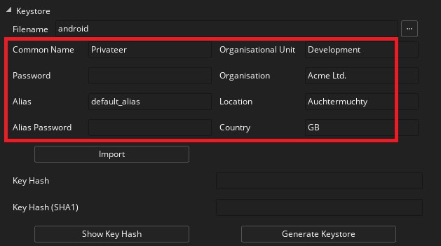

@title Extension Setup

This extension provides no in-game functions and only requires some initial setup. To correctly set up your game please follow these steps:

1. Once you have the extension installed, you then need to set up licensing (see [Setting Up a Publisher Account](https://developer.android.com/google/play/licensing/setting-up#account)). For that, go to your Google Play dashboard and set up an **App Listing** for the game (from your Google Play console click the **Create Application** button and follow the on-screen prompts). You then need to get the Public Key from the **Monetise** → **Monetisation Setup** section of the Developer Console and copy the Licensing Public Key from the box at the bottom.

2. You need to copy that to the clipboard then go back to GameMaker and add it into the **Google Licensing Public Key** field of the [**Packaging**](https://manual.yoyogames.com/Settings/Game_Options/Android.htm#packaging) section under [Android Game Options](https://manual.yoyogames.com/Settings/Game_Options/Android.htm).

3. Now, with Google Licensing enabled, testing your game will show a message saying that the game could not be licensed, with the option to either **Retry** the connection or to go to the store to **Buy** the game.

It looks like the licensing works, but you can't test the game anymore... to fix this so you can continue developing (and in the process see that the licensing works) you need to create an **Alpha** build of the project and upload it to the store.

4. Before you can test that the licensing works and keep playing your game on your devices, you will need to upload an APK of the project as an **Alpha** or an **Internal Test** build. To do this, you should first fill in the minimum required details for your app listing on the console, shown in the following image: 

Some of these sections require you to upload an APK first, so go to the section **App Releases** and click the **Manage Alpha** (or the Manage Internal Test) text. On the next page you want to create a **New Alpha/Test Release**.

[[NOTE: At this point you will be asked if you want to use Google Play App Signing for your game. You should select **CONTINUE/FINISH** for this, as it is required for the extension to work.]]

5. Once you opt into the App Signing program, you can then upload an APK as an Alpha/Test build (if you don't know how to make an APK then please see the article [Android: Compiling Your App](https://help.yoyogames.com/hc/en-us/articles/115001624867-Compiling-Your-Android-App)). Once it's uploaded you should then continue to fill out the rest of the relevant app listing details (like content rating or pricing), and then when all is correct (you will see green ticks beside the relevant items) you can return to the Alpha/Test section, review the details and publish.

[[NOTE: When you opt in to the Google Licensing, you will need to sign each app with a **UNIQUE KEYSTORE**. This is a security measure implemented by Google as part of the licensing system. Don't forget that you need to keep this **.keystore** file along with its information stored in your hard drive in order to be able to update your application.]]

Note that once you publish the Alpha/Test build, it can take a few hours for it to be accepted and another few hours for it to become "live" and available for testing.

6. Once the app is live as an Alpha on the Play Store, you should delete any test APK's created by GameMaker that are on your device, and then download the version from the Google Play Store. This should be run once to ensure that licensing is working as required. You should be able to run the game now from GameMaker on your Android device and the previous message about retrying or buying will not be shown, indicating that the project has been licensed correctly.

[[NOTE: If you still get the licensing warning message, make sure that the email used to register the device is part of the defined **Testers** (as a developer your email should be automatically added, see [Setting Up the Testing Environment](https://developer.android.com/google/play/licensing/setting-up#test-env)]]